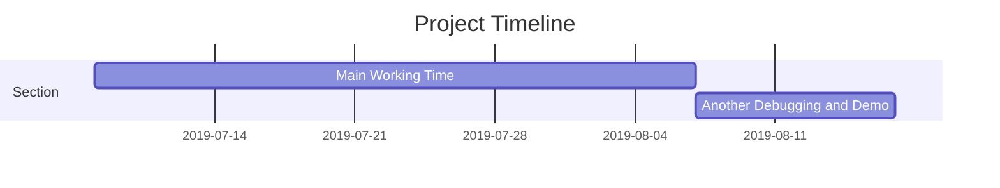

2019SJTU SummerProject-FaceRecognition
===


## Table
---
[TOC]

Project Timeline
---




> Read more about mermaid here: https://github.com/sty61010/2019SJTU_SummerProject_FaceRecognition

## Abstration
---

## Files
---
- Python Code:
    - Collect_Date.py
    - Train.py
    - FaceRecognition.py
    - Age_Gender.py
    - Age_Gender_fix.py
    - Emotion.py
    - Mask.py
    - Mode01_Lock.py
    - Mode02_Detection.py
    - Mode03_Mask.py
    - MainProgram.py

- Folder
    - dataset
    - images
    - trainer
    - utils
    - data
    - capture

## Graph
---
```sequence

Collect_Data.py->Train.py:collecting data
Train.py->Mode01_Lock.py:Recognition
Mode01_Lock.py->Mode02_Detection.py:Lock to Detection
Mode02_Detection.py->Mode03_Mask.py:Detection to Masking
Note left of Collect_Data.py: Pretraining
Note left of Train.py: Training

Note left of Mode01_Lock.py: MainProgram

```
## Details
---
:::info
- Python Code:
    - Collect_Date.py
        - Collect pictures into folder "dataset".
        - Using OpenCV haarcascade to capture face
        - 
        - Turn the image to gray color
        - 
        - Capture 30 picture from new user
        - 

    - Train.py
        - Include Recognizer
        - 
        - Function to get images and label data
        - 
        - Save the model into trainer/trainer.yml
        - 

    - FaceRecognition.py
    - Age_Gender.py
        - Load Model
        - 
        - Load Network
        - 
        - Detection
        - 


    - Age_Gender_fix.py
    - Emotion.py
        - Include Recognizer
        - 
        - Load Models
        - 
        - Models path
        - 
        - Capture face and turn into gray image. Then do the detection.
        - 

    - Mask.py
    - Mode01_Lock.py
    - Mode02_Detection.py
        - Set labels
        - 
        - Include OpenCV Haar Cascade Model
        - 
        - Include Coffee Model
        - 
        - Load Network
        - 
        - Get Emotion
        - 
        - Get Gender and Age
        - 
        - Draw Labels
        - 
        - Change Color
        - 
    - Mode03_Mask.py
    - MainProgram.py


:::

- Folder
    - dataset
        - Data of Users 
    - images
        - Save image for mask
    - trainer
        - Save trainer for facial recognition
    - utils
        - Detection function for Age and Gender detection.
    - data
        - Detection function for expression detection.
    - capture
        - Capture pictures
## Theory
---
- Collect_Date.py
- Train.py
- FaceRecognition.py
- Age_Gender.py
- Age_Gender_fix.py
- Emotion.py
- Mask.py
- Mode01_Lock.py
- Mode02_Detection.py
- Mode03_Mask.py

> Read more about Gherkin here: https://github.com/sty61010/2019SJTU_SummerProject_FaceRecognition


## Function
---
:::success
- Collect_Date.py
    - Collect datas from people. Also add new users' pictures into folder "dataset".
- Train.py
    - After finishing new users, train Users in "dataset". When Training is done. save trainer into folder "trainer".
- FaceRecognition.py
    - Use Trainer to practice face recognitions.
- Age_Gender.py
    - Detect the person's gender by using Coffee model in "data/gender_net.caffemodel"
- Age_Gender_fix.py
    - Detect the person' gender by using presetting data set in MainProgram.py
- Emotion.py
    - Real-time face detection and emotion/gender classification using fer2013/IMDB datasets with a keras CNN model and openCV.
- Mask.py
    - Mask Person by openCV.
- Mode01_Lock.py
    - Functional Implement of facial recognition.
- Mode02_Detection.py
    - Fucntional Implement of facial detection
- Mode03_Mask.py
    - Functional Implement of facial Mask
- MainProgram.py
    - Merge of:
        - Mode01_Lock.py
        - Mode02_Detection.py
        - Mode03_Mask.py
:::

> Read more about sequence-diagrams here: https://github.com/sty61010/2019SJTU_SummerProject_FaceRecognition


## Appendix and FAQ

:::info
> github:https://github.com/sty61010/2019SJTU_SummerProject_FaceRecognition
> gitlab:https://gitlab.com/106034061/2019sjtu_summerproject_facerecognition
:::

## Reference
:::danger
- [OpenCV-Face-Recognition](https://github.com/Mjrovai/OpenCV-Face-Recognition)
- [树莓派+STM32人脸识别门禁系统（中）----- 树莓派部分](https://blog.csdn.net/a568713197/article/details/85267764)
- [人臉辨識系列](https://blog.csdn.net/fire_light_)
- [OpenCV 4.0 C++/python SDK tutorial](https://github.com/gloomyfish1998/opencv_tutorial)
- [OpenCV实现年龄与性别预测](https://blog.csdn.net/weixin_40787712/article/details/88969117)
- [Face classification and detection.](https://github.com/sty61010/face_classification)
- [【深度学习】基于caffe的表情识别（一）：概述](https://blog.csdn.net/pangyunsheng/article/details/79434263)
- [【计算视觉】人脸属性识别算法 | 性别+种族+年龄+表情](https://blog.csdn.net/ztf312/article/details/87879698)
- [根据人脸预测年龄性别和情绪 （python + keras）（三）](https://blog.csdn.net/hpyMiss/article/details/80759500)
- [深度学习（十四）基于CNN的性别、年龄识别](https://blog.csdn.net/GarfieldEr007/article/details/50580929)
- [基于mtcnn和facenet的实时人脸检测与识别系统开发](https://zhuanlan.zhihu.com/p/25025596)
- [FaceNet-with-TripletLoss](https://github.com/sty61010/FaceNet-Real-Time-face-recognition)
- [Facenet: Real-time face recognition using deep learning Tensorflow](https://github.com/sty61010/Facenet-Real-time-face-recognition-using-deep-learning-Tensorflow)
- [Real-time Face Recognition Using FaceNet | AI SANGAM](http://www.aisangam.com/blog/real-time-face-recognition-using-facenet/)
- [機器學習 ML NOTE YOLO!!!如何簡單使用YOLO訓練出自己的物件偵測!!! ](https://medium.com/%E9%9B%9E%E9%9B%9E%E8%88%87%E5%85%94%E5%85%94%E7%9A%84%E5%B7%A5%E7%A8%8B%E4%B8%96%E7%95%8C/%E6%A9%9F%E5%99%A8%E5%AD%B8%E7%BF%92-ml-note-yolo-%E5%88%A9%E7%94%A8%E5%BD%B1%E5%83%8F%E8%BE%A8%E8%AD%98%E5%81%9A%E7%89%A9%E4%BB%B6%E5%81%B5%E6%B8%AC-object-detection-%E7%9A%84%E6%8A%80%E8%A1%93-3ad34a4cac70)
- [Face Detection – OpenCV, Dlib and Deep Learning ( C++ / Python )](https://www.learnopencv.com/face-detection-opencv-dlib-and-deep-learning-c-python/)
- [OpenCV vs Dlib 人脸检测比较分析](https://www.52cv.net/?p=1600)
- [Methods for face detection and face recognition - A review](https://medium.com/beesightsoft/methods-for-face-detection-and-face-recognition-a-review-57e73af1d67)
- [(Faster) Facial landmark detector with dlib](https://www.pyimagesearch.com/2018/04/02/faster-facial-landmark-detector-with-dlib/)
- [CNN based face detector from dlib](https://www.arunponnusamy.com/cnn-face-detector-dlib.html)
- [Face recognition with OpenCV, Python, and deep learning](https://www.pyimagesearch.com/2018/06/18/face-recognition-with-opencv-python-and-deep-learning/)
- [Face Detection For Beginners](https://towardsdatascience.com/face-detection-for-beginners-e58e8f21aad9)
- []()

:::
###### tags: `Facial Recognition` `Deep Learning` `Computer Vision` `Side Project`
